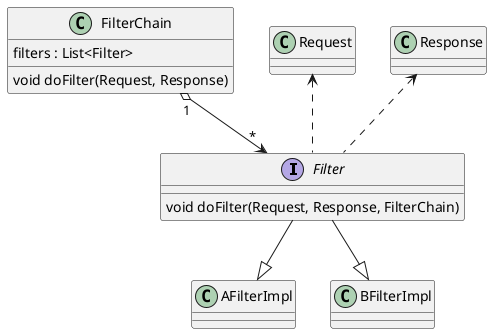

# 责任链模式

> [UML类图源码](http://www.plantuml.com/plantuml/uml/XO_12i8m44Jl-nLBJYfDmQkKKXK4mLF_8BHR3AH9xQPUr7-tcXJYoLlcpUmCgTYhqK-z0MqzZPrg24_Qp4zy0DwTRh5r0Qngkat4FiEQU72MAOlHurLfkuONG6CKSqe_BTrNCkxmejaNmIt_ji-5iIzQKIr-bFjmV-u74yaX8G11e9JFCisc_FSYhc6HvnWuB9CfW_INOYlGILcYs8WbK95jfzwy0G00)

