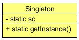

# 单例设计模式

## UML

## 参考

[Singleton Design Pattern in Java - Example Tutorial](http://www.javacodegeeks.com/2015/09/singleton-design-pattern.html)

[Java:单例模式的七种写法](http://www.blogjava.net/kenzhh/archive/2013/03/15/357824.html)

[单例模式中为什么用枚举好](http://www.importnew.com/6461.html)

[Java枚举单例模式](http://segmentfault.com/q/1010000000646806)