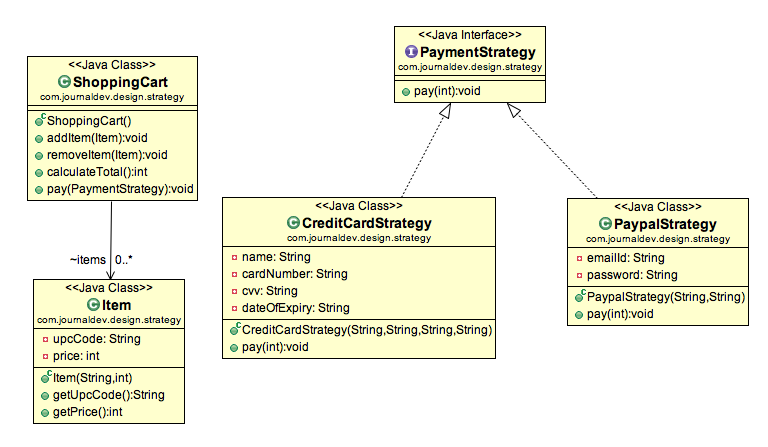

# 策略模式

## 策略模式URL图

## 代码

[示例代码](../src/main/java/com/github/tonydeng/desgin/strategy)

[测试代码](../src/test/java/com/github/tonydeng/desgin/strategy)

## 参考

[Java中的策略模式实例教程](http://ifeve.com/strategy-design-pattern-in-java-example-tutorial/)

[Strategy Design Pattern in Java-Example Tutorial](http://www.javacodegeeks.com/2013/08/strategy-design-pattern-in-java-example-tutorial.html)